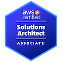

[Email](mailto:douglasr.figueroa@gmail.com?subject=Job%20offer) / [LinkedIn](https://www.linkedin.com/in/douglasfigueroa/) / [GitHub](https://github.com/DougFigueroa) / [Stackoverflow](https://stackoverflow.com/users/6840517/douglas-figueroa) / [Technical Blog](https://dougf.hashnode.dev/)

# Professional Summary:
Highly driven data engineer, AWS certified solutions architect and certified developer with +6 years of experience creating, implementing and improving data solutions across organizations to have clean data ready for decision making and operational systems in a timely matter, to help organizations to be data-driven.

Love to solve problems through code and I'm always looking to lear something new. Curious about technology and the lastest trends. Team player and I really love to help people with my work or experience.

# Skills:
- Python 3.x with different libraries and tools like Jupyter, pandas, boto3, scikit-learn, pyspark,  etc.
- AWS services (S3, Lambda, Glue, Sagemaker, StepFunctions, Cloudformation, etc.)
- SQL & PL/SQL and general database DML/DDL development.
- ETLs and data pipelines development and deploy.
- Cloud solutions architecture.
- Data governance.
- Hive and Spark.
- IaC, CI/CD and Git.
- Data analysis and data wrangling.
- Scrum.
- Machine Learning basics.
- Denodo management and development.
- Databases.
- Rest APIs and GraphQL development and using them.
- Relational and Dimensional Modelling.
- Azure services basics.
- Analytical thinking.
- Self-taught and innovative. 
- Problem-solving skills.
- Time management.
- Collaborative and client focus.

# Experience:
- ### Data Engineer Consultant
    **IDB *(Aug 2021 - Present)***

- ### Data Engineer Consultant
    **LifeMiles(Avianca) *(Feb 2017 - July 2021)***
    -   Successful migration of the data of all on-premises legacy systems to the company’s new core system on the cloud, 	with an accuracy of 99.97% on data validations, meeting the deadlines with optimal times. 
    -   Design and development of the company’s data lake on the AWS cloud, delivering data to business users as analysis, reports, dashboards or APIs. Developing the data pipelines using Python, Spark, EMR clusters, Step Functions and S3, while complying with all the security standards.
    -   Design and implementation of the CI/CD strategy to deploy data engineering solutions using Infrastructure as Code in multiple environments while meeting all the security requirements

- ### Developer Junior.
    **Avianca, El Salvador *(Nov 2016 - Jan 2017)***
    Development and implementation of solutions, using SQL, PL/SQL and Java, to provide users with the ability of generate meaningful reports.
- ### Developer
    **Supreme Court of Justice, El Salvador *(Feb 2015 - Aug 2015)***
    Development of the case tracking system for the Criminal Chamber, meeting the objective of speed up and give order to the process that has been always done in a manual manner, improving the cases processsing times. Done using PHP, JavaScript and MySQL

# Certifications
- AWS Certified Solutions Architect Associate.
- AWS Certified Developer Associate.   
- Scrum Foundation Professional.
- Microsoft Technology Associate, Web Development Fundamentals.

  

# Education:
**Information systems engineer**
*University of El Salvador. 2012 - 2018*

# Languages:
- English
- Spanish
